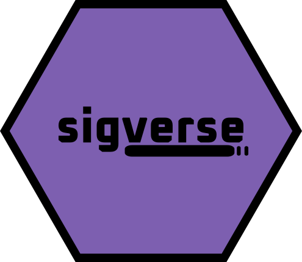

<!-- README.md is generated from README.Rmd. Please edit that file -->

```{r, include = FALSE}
knitr::opts_chunk$set(
  collapse = TRUE,
  comment = "#>",
  fig.path = "man/figures/README-",
  out.width = "100%"
)
```

# sigverse 

<!-- badges: start -->

[](https://lifecycle.r-lib.org/articles/stages.html#experimental)

<!-- badges: end -->

The **sigverse** simplifies evaluation, exploration, visualisation of mutational signatures in R.

```{=html}

```

For **turnkey** mutational signature analysis, see [sigscreen](https://github.com/selkamand/sigscreen).

The **sigverse** itself does **NOT** seek to provide custom implementations for running signature analyses.

It simply provides tools for evaluating, exploring, and reporting the results signature analyses done with existing signature analysis frameworks (we recommend [sigminer](https://github.com/ShixiangWang/sigminer) if you're using R).

**WARNING: Sigverse is in early development, and not yet ready for use**

## Installation

You can install the development version of sigverse from [GitHub](https://github.com/) with:

``` r
if (!require("pak", quietly = TRUE))
    install.packages("pak")

pak::pak("selkamand/sigverse")
```

## Usage

### Visualisation

1.  Visualise Signatures

```{r, eval = TRUE, fig.height = 4, fig.width=10}
library(sigverse)

# Load signatures from sigstash
signatures <- sig_load("COSMIC_v3.3.1_SBS_GRCh38")

# Visualise a single signature
sig_visualise(signatures[["SBS5"]])

```

2.  Visualise Catalogues

Note to access the TCGA catalogues first install the datasets using `remotes::install_github("selkamand/TCGAcatalogues")`

```{r, fig.height = 4, fig.width=10}
# Load mutational profile catalogue from the TCGAcatalogues package
library(TCGAcatalogues) 
brca_catalalogue <- catalogues_load('BRCA')

# Visualise an observed mutational catalogue
sig_visualise(
  brca_catalalogue[['TCGA-BH-A18P-01A-11D-A12B-09']],
  class = "catalogue"
  )
```

3.  Visualise a Signature Model

The primary output of ANY signature analyse is a model which describes the set of signatures which, when combined with certain weights approximate the observed mutational pattern in a sample. For example the model might look like

Signature1 \* 0.2 + Signature2 \* 0.3 + Signature3 \* 0.5 = Simulated Catalogue that (hopefully) represents the observed profile.

We can visualise a signature model as follows

```{r, fig.height = 4, fig.width=10}

# Load a signature from sigstash
signatures <- sig_load("COSMIC_v3.3.1_SBS_GRCh38")

# Build a signature model signature 'SBS2' explains 40% of the mutations in a sample, and 'SBS13' explains the remaining 60%
model = sig_combine(signatures, model = c('SBS2' = 0.4, 'SBS13' = 0.6), format = "combined")

# Visualise the model
sig_visualise(model, class = 'model')
```

4.  Visualize a cohort

> **Warning**
> 
> Cohort visualisations are not yet available in the sigverse


If you've got sequencing results from a cohort, sigvis lets you either.

1.  Visualise the results of a sample of interest in the context of the broader cohort

2.  Visualise the cohort trends

The input to the visualiser is a 'cohort signature dataframe' (see sigvis for details)

```{r, eval = FALSE}

# Load cohort signature results from sigstash
cohort = sig_load_sigstash_tcga('BRCA')

# Visualise Cohort
sig_visualise_cohort(cohort)


# Contextualize Sample with Cohort Results
sig_visualise_sample_in_cohort(cohort, 'TCGA-D8-A1XU') 
```

### Reporting

> **Warning**
> 
> Interactive sample reports are not yet available in the sigverse

After running a signature analysis on your sample of interest, produce a html report describing the result.

The core report generation engine requires high level information that most signature analyses will output, irrespective of the exact methods used.

In this example we manually define the properties of our model to demonstrate the expected inputs

```{r, eval = FALSE}

# Specify your catalogue
observed_catalogue = example_catalogue

# Specify your model
model = c('SBS1' = 0.4, 'SBS2' = 0.5)

# Specify aetiologies of any signatures in your model
aetiology = list(
  SBS1 = 'Spontaneous deamination of 5-methylcytosine (clock like signature)',
  SBS2 = 'Activity of APOBEC family of cytidine deaminases'
  )

# Specify similar samples (optional, only supply if you want to compare to some larger cohort)
similar_samples = data.frame(
  sample_id = c('Sample1', 'Sample2', 'Sample3'),
  cosine_similarity = c(0.96, 0.95, 0.8)
)


# Produce the html report
sig_story(
  observed = observed_catalogue
  model = model,
  aetiology = aetiology,
  similar_samples = similar_samples
)
```

### Simulation

> **Warning**
> 
> Simulation functions are not yet available in the sigverse

sigsim allows you to simulate mutational catalogues by combining different mutational signatures, plus spike known amounts of noise. This can be useful for benchmarking signature tools.

```{r, eval = FALSE}

# Load signatures from sigstash
signatures <- sig_load("COSMIC_v3.3.1_SBS_GRCh38")


# Simulate Signatures
sig_simulate(signatures, c('SBS3' = 0.5, "SBS4" = 0.5))
```

### Statistics

sigstats contains functionality to compute basic signature related statistics. For example, computing cosine similarity of two mutational catalogues.

### Utilities

sigshared is a collection of utilities that most packages in the sigverse use. It contains functions to help identify input types, assert they're as expected.

## Key Object Types

The sigverse needs to work downstream of many different signature analysis tools.
To maximise interoperability all expected inputs are simple dataframes and lists, rather
than sigverse specific S3/S4/R8/R7 objects.

All data types used by sigverse packages are described in [sigshared documentation](https://github.com/selkamand/sigshared)

## Similar tools

Most signature analysis packages provide their own suite of visualisation and 
exploration tools. To simplify your software stack, we recommend only using the 
sigverse for the following reasons:

1.  you run multiple signature analysis tools and want a uniform way of exploring the results

2.  want to benchmark signature analysis packages

3.  Find missing functionality (e.g. cohort signature result exploration / no reporting modules)

## Links to sigverse packages

-   [sigstash](https://github.com/selkamand/sigstash) for signature collections

-   [sigvis](https://github.com/selkamand/sigvis) for signature visualisation

-   [sigstats](https://github.com/selkamand/sigstats) for signature statistics (e.g. cosine similarity)

-   [sigsim](https://github.com/selkamand/sigsim) for simulating signatures / sample profiles

-   [sigstory](https://github.com/selkamand/sigstory) for reporting results of signature analyses

-   [sigshared](https://github.com/selkamand/sigshared) for utilities used by many of the sigverse packages

## Links to sigverse-adjacent packages

-   [TCGAcatalogues](https://github.com/selkamand/TCGAcatalogues) for loading TCGA sample catalogues

