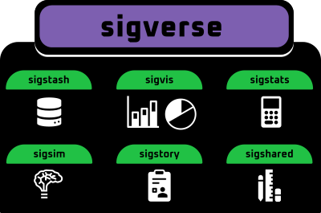

<!-- README.md is generated from README.Rmd. Please edit that file -->

# sigverse 

<!-- badges: start -->

[](https://lifecycle.r-lib.org/articles/stages.html#experimental)

<!-- badges: end -->



sigverse simplifies evaluation, exploration, visualisation of mutational
signatures in R.

sigverse does NOT seek to provide custom implementations for running
signature analyses.

It simply provides tools for evaluating, exploring, and reporting the
results signature analyses done with any existing signature analysis
frameworks (although we recommend
[sigminer](https://github.com/ShixiangWang/sigminer) if you’re using R).

**WARNING: Sigverse is in early development, and not yet ready for use**

## Installation

You can install the development version of sigverse from
[GitHub](https://github.com/) with:

``` r
# install.packages("devtools")
devtools::install_github("selkamand/sigverse")
```

## Usage

### Visualisation

1.  Visualise Signatures

``` r
library(sigverse)

# Load signatures from sigstash
signatures <- sig_load_cosmic_v3()

# Visualise a singal signature
sig_visualise(signatures, "SBS5")
```

2.  Visualise Decompositions

``` r

# Load decompositions from sigstash
brca_decompositions <- sig_load_decomposition_tcga('BRCA')

# Visualise a decomposition
sig_visualise(brca_decompositions, 'TCGA-D8-A1XU')
```

3.  Visualise a Signature Model

The primary output of ANY signature analyse is a model which describes
the set of signatures which, when combined with certain weights
(hopefully) explain the observed mutational pattern in a sample. For
example the model might look like

Signature1 \* 0.2 + Signature2 \* 0.3 + Signature3 \* 0.5 = Simulated
Decomposition that (hopefully) represents the observed decomposition

We can visualise this signature model as follows

``` r

# Load a signature from sigstash
signatures <- sig_load_cosmic_v3()

# Visualise the decomposition expected from a signature model, where signature 'SBS1' explains 40% of the mutations in a sample, and 'SBS2' explains the remaining 40%
sig_visualise(signatures, model = c('SBS1' = 0.4, 'SBS2' = 0.6))
```

4.  Visualize a cohort

If you’ve got sequencing results from a cohort, sigvis lets you either.

1.  Visualise the results of a sample of interest in the context of the
    broader cohort

2.  Visualise the cohort trends

The input to the visualiser is a ‘cohort signature dataframe’ (see
sigvis for details)

``` r

# Load cohort signature results from sigstash
cohort = sig_load_sigstash_tcga('BRCA')

# Visualise Cohort
sig_visualise_cohort(cohort)


# Contextualize Sample with Cohort Results
sig_visualise_sample_in_cohort(cohort, 'TCGA-D8-A1XU') 
```

### Reporting

After running a signature analysis on your sample of interest, produce a
html report describing the result.

The core report generation engine requires high level information that
most signature analyses will output, irrespective of the exact methods
used.

In this example we manually define the properties of our model to
demonstrate the expected inputs

``` r

# Specify your decomposition
observed_decomposition = example_decomposition

# Specify your model
model = c('SBS1' = 0.4, 'SBS2' = 0.5)

# Specify aetiologies of any signatures in your model
aetiology = list(
  SBS1 = 'Spontaneous deamination of 5-methylcytosine (clock like signature)',
  SBS2 = 'Activity of APOBEC family of cytidine deaminases'
  )

# Specify similar samples (optional, only supply if you want to compare to some larger cohort)
similar_samples = data.frame(
  sample_id = c('Sample1', 'Sample2', 'Sample3'),
  cosine_similarity = c(0.96, 0.95, 0.8)
)


# Produce the html report
sig_story(
  observed = observed_decomposition
  model = model,
  aetiology = aetiology,
  similar_samples = similar_samples
)
```

### Simulation

sigsim allows you to simulate decompositions matrices by combining
different mutational signatures, plus spike known amounts of noise. This
can be useful for testing various analytical toolkits.

``` r

# Load signatures from sigstash
signatures <- sig_load_cosmic_v3()


# Simulate Signatures
sig_simulate(signatures, c('SBS3', "SBS4"))
```

### Statistics

sigstats contains functionality to compute basic signature related
statistics. For example, computing cosine similarity of two
decompositions.

### Utilities

sigshared is a collection of utilities that most packages in the
sigverse use. It contains functions to help identify input types, assert
they’re as expected.

## Key Object Types

The sigverse needs to work downstream of many different signature
analysis tools.

There are 6 key types of data the sigverse uses.

**Signatures**: data.frames with 3 columns (channel, type, and fraction)

**Signature Collections**: Lists of signature data.frames, where name of
list entry is the name of the signature

**Signature Aetiology Collections**: data.frames with 2 columns
(signature, aetiology)

**Decompositions**: data.frames with 4 columns (channel, type, fraction,
count)

**Decomposition Collections**: Lists of decomposition data.frames (1 per
sample) where name represents a sample identifier

**Cohort Signature Analysis Results**: data.frame with 4 columns
(sample, signature, contribution, bootstraps)

## Similar tools

Most signature analysis packages provide their own suite of
visualisation and exploration tools. To simplify your software stack, we
reccomend only using sigverse for the following reasons:

1.  you run multiple signature analysis tools and want a uniform way of
    exploring the results

2.  want to benchmark signature analysis packages

3.  Find missing functionality (e.g. cohort signature result exploration
    / no reporting modules)
